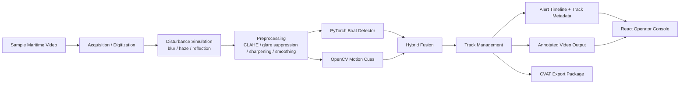

# System Workflow

## Processing stages

1. The acquisition layer accepts a local MP4 input or one of the demo sources downloaded from the web.
2. A disturbance profile can inject blur, haze, or reflection artifacts so the PoC visibly demonstrates robustness handling.
3. Enhancement stages recover contrast and reduce glare before detection.
4. PyTorch `torchvision` detection focuses on the COCO `boat` class while OpenCV motion cues keep candidate targets alive between inference frames.
5. A lightweight IoU tracker assigns persistent track IDs, keeps short histories, and raises watch or critical alerts based on persistence and apparent target growth.
6. The backend writes a digitized input copy, an annotated output video, a preview frame, a timeline JSON artifact, and an optional CVAT-ready export bundle.

## Assumptions

- The PoC uses generic pretrained `torchvision` weights, so maritime identification is limited to the `boat` class and motion-supported candidates.
- Disturbance handling is intentionally transparent and operator-tunable so the demo highlights workflow and recovery rather than claiming mission-grade performance.
- The tracker is optimized for explainability and fast iteration, not dense multi-object scene resolution.

